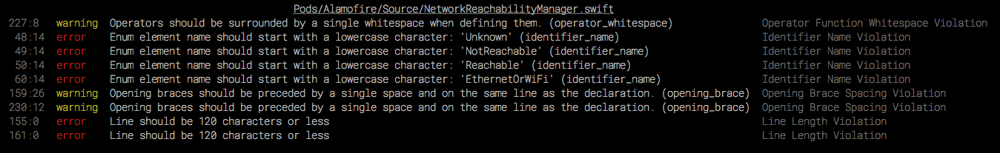

# swizzy

[](https://eslint.org)
[](https://www.typescriptlang.org)

Swizzy is a pretty formatter for SwiftLint output. It transforms SwiftLint's standard output into a more readable and stylish format. This project is inspired by [snazzy](https://github.com/feross/snazzy).



## Features

- Formats SwiftLint output in a compact and stylish way
- Written in TypeScript for better maintainability and type safety
- Easy integration with existing SwiftLint workflows
- Customizable output formatting
- Works seamlessly with CI/CD pipelines

## Installation

You can install swizzy globally using npm or yarn:

```bash
# Using npm
npm install -g swizzy

# Using yarn
yarn global add swizzy
```

Make sure you have SwiftLint installed:

```bash
brew install swiftlint
```

## Usage

Simply pipe SwiftLint output to swizzy:

```bash
swiftlint lint --reporter json | swizzy
```

Or use it in your package.json scripts:

```json
{
  "scripts": {
    "lint:swift": "swiftlint lint | swizzy"
  }
}
```

## Development

To contribute to swizzy, clone the repository and install dependencies:

```bash
git clone https://github.com/yourusername/swizzy.git
cd swizzy
npm install
```

Available scripts:

```bash
# Build the project
npm run build

# Run tests
npm test

# Lint code
npm run lint

# Fix linting issues
npm run lint:fix
```

## Testing

Swizzy uses Jest for testing. Run the test suite with:

```bash
cat anonymized_lint.json | node dist/index.js
```

## Contributing

1. Fork the repository
2. Create your feature branch (`git checkout -b feature/amazing-feature`)
3. Commit your changes (`git commit -am 'Add some amazing feature'`)
4. Push to the branch (`git push origin feature/amazing-feature`)
5. Open a Pull Request

## License

[MIT](https://choosealicense.com/licenses/mit/)

[standard-url]: https://standardjs.com