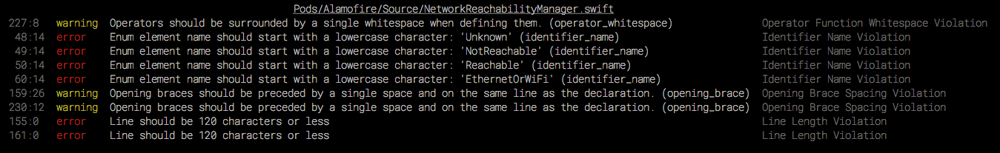

# swizzy

[](https://www.npmjs.com/package/swizzy)
[](https://www.typescriptlang.org)
[](https://eslint.org)
[](https://github.com/sharat/swizzy/blob/main/LICENSE)
[](https://nodejs.org)

A modern, high-performance CLI tool that transforms SwiftLint JSON output into beautiful, readable formats. Built with TypeScript for reliability and featuring multiple output formats, configuration file support, and seamless CI/CD integration.



## ✨ Features

- **🎨 Beautiful Formatting**: Transform ugly JSON into clean, readable reports
- **📊 Multiple Output Formats**: Compact, table, and JSON formats
- **⚡ High Performance**: Built with modern TypeScript and streaming for large codebases
- **🔧 Configurable**: Support for configuration files and CLI options
- **🚀 CI/CD Ready**: Perfect for automated workflows and pipelines
- **🛡️ Type Safe**: Built with TypeScript and Zod for robust error handling
- **📦 Zero Config**: Works out-of-the-box with sensible defaults
- **🎯 SwiftLint Integration**: Seamlessly integrates with SwiftLint workflows

## 🚀 Quick Start

### Installation

Choose your preferred package manager:

#### npm
```bash
# Global installation
npm install -g swizzy

# Or use npx (no installation required)
npx swizzy
```

#### pnpm
```bash
# Global installation
pnpm add -g swizzy

# Or use pnpm dlx (no installation required)
pnpm dlx swizzy
```

#### yarn
```bash
# Global installation
yarn global add swizzy

# Or use yarn dlx (no installation required)
yarn dlx swizzy
```

#### bun
```bash
# Global installation
bun add -g swizzy

# Or use bunx (no installation required)
bunx swizzy
```

### Prerequisites

Make sure you have SwiftLint installed:

```bash
# macOS (Homebrew)
brew install swiftlint

# macOS (MacPorts)
sudo port install swiftlint

# Linux (using Mint)
mint install realm/SwiftLint

# Or download from GitHub releases
# https://github.com/realm/SwiftLint/releases
```

## 📋 Usage

### Basic Usage

The most common usage is piping SwiftLint output directly to swizzy:

```bash
swiftlint lint --reporter json | swizzy
swiftlint . | swizzy
```

### Package Manager Examples

#### With npm
```bash
# Using globally installed swizzy
swiftlint lint --reporter json | swizzy

# Using npx (no global install needed)
swiftlint lint --reporter json | npx swizzy
swiftlint . | npx swizzy
```

#### With pnpm
```bash
# Using globally installed swizzy
swiftlint lint --reporter json | swizzy

# Using pnpm dlx (no global install needed)
swiftlint lint --reporter json | pnpm dlx swizzy
```

#### With yarn
```bash
# Using globally installed swizzy
swiftlint lint --reporter json | swizzy

# Using yarn dlx (no global install needed)
swiftlint lint --reporter json | yarn dlx swizzy
```

#### With bun
```bash
# Using globally installed swizzy
swiftlint lint --reporter json | swizzy

# Using bunx (no global install needed)
swiftlint lint --reporter json | bunx swizzy
```

### Automatic SwiftLint Execution

If you run swizzy without piped input, it will automatically execute SwiftLint:

```bash
swizzy  # Automatically runs: swiftlint lint --reporter json
```

## 🛠️ CLI Options

```bash
swizzy [options]
```

| Option | Short | Description | Default |
|--------|-------|-------------|---------|
| `--format` | `-f` | Output format: `compact`, `json`, `table` | `compact` |
| `--config` | `-c` | Path to configuration file | - |
| `--quiet` | `-q` | Suppress non-essential output | `false` |
| `--no-color` | | Disable colored output | `false` |
| `--help` | `-h` | Show help message | - |
| `--version` | `-v` | Show version number | - |

### Format Examples

#### Compact Format (Default)
```bash
swiftlint lint --reporter json | swizzy --format compact
```

#### Table Format
```bash
swiftlint lint --reporter json | swizzy --format table
```

#### JSON Format
```bash
swiftlint lint --reporter json | swizzy --format json
```

#### Quiet Mode (for CI/CD)
```bash
swiftlint lint --reporter json | swizzy --quiet
```

#### Disable Colors
```bash
swiftlint lint --reporter json | swizzy --no-color
```

## ⚙️ Configuration File

Create a `swizzy.config.json` file for persistent configuration:

```json
{
  "format": "compact",
  "quiet": false,
  "noColor": false
}
```

Use the configuration file:

```bash
swizzy --config ./swizzy.config.json
```

### Configuration Precedence

Configuration values are resolved in this order (highest to lowest precedence):

1. CLI arguments (`--format compact`)
2. Configuration file (`swizzy.config.json`)
3. Default values

## 🔄 CI/CD Integration

### GitHub Actions

Add swizzy to your GitHub Actions workflow:

```yaml
name: SwiftLint

on:
  pull_request:
  push:
    branches: [main]

jobs:
  swiftlint:
    runs-on: macos-latest
    steps:
      - uses: actions/checkout@v4

      - name: Install SwiftLint
        run: brew install swiftlint

      - name: Install swizzy
        run: npm install -g swizzy

      - name: Run SwiftLint with swizzy
        run: swiftlint lint --reporter json | swizzy --quiet

      # Alternative: Use npx (no installation required)
      - name: Run SwiftLint with swizzy (npx)
        run: swiftlint lint --reporter json | npx swizzy --quiet
```

### Fastlane Integration

Add to your `Fastfile`:

```ruby
desc "Run SwiftLint with swizzy formatting"
lane :lint do
  # Install swizzy if not already installed
  sh("npm list -g swizzy || npm install -g swizzy")

  # Run SwiftLint with swizzy
  sh("swiftlint lint --reporter json | swizzy")
end

# Or with specific format
lane :lint_table do
  sh("swiftlint lint --reporter json | swizzy --format table")
end
```

### Xcode Build Phases

Add a new "Run Script" build phase:

```bash
#!/bin/bash
if which swiftlint >/dev/null && which swizzy >/dev/null; then
  swiftlint lint --reporter json | swizzy
else
  echo "warning: SwiftLint or swizzy not installed"
fi
```

### npm Scripts Integration

Add to your `package.json`:

```json
{
  "scripts": {
    "lint": "swiftlint lint --reporter json | swizzy",
    "lint:table": "swiftlint lint --reporter json | swizzy --format table",
    "lint:quiet": "swiftlint lint --reporter json | swizzy --quiet",
    "lint:ci": "swiftlint lint --reporter json | swizzy --quiet --no-color"
  }
}
```

Then run:

```bash
npm run lint
# or
pnpm run lint
# or
yarn lint
# or
bun run lint
```

## 🔍 Output Formats

### Compact Format (Default)

The compact format groups issues by file and presents them in a clean, hierarchical view:

```
src/ViewController.swift

   12:5   warning  Line should be 120 characters or less: currently 134 characters  line_length
   25:12  error    Force cast should be avoided                                       force_cast

src/Model.swift

   8:1    warning  Missing docs for public function                                  missing_docs

✖ 3 problems
```

### Table Format

The table format presents all issues in a structured table:

```
File                    Line  Col  Severity  Rule          Message
src/ViewController.swift  12    5   Warning   line_length   Line should be 120 characters or less
src/ViewController.swift  25   12   Error     force_cast    Force cast should be avoided
src/Model.swift           8    1    Warning   missing_docs  Missing docs for public function

✖ 3 problems
```

### JSON Format

The JSON format outputs the parsed and validated SwiftLint issues:

```json
[
  {
    "character": 5,
    "file": "src/ViewController.swift",
    "line": 12,
    "reason": "Line should be 120 characters or less: currently 134 characters",
    "rule_id": "line_length",
    "severity": "Warning",
    "type": "Line Length"
  }
]
```

## 🛡️ Error Handling & Exit Codes

swizzy uses semantic exit codes for better CI/CD integration:

| Exit Code | Meaning |
|-----------|---------|
| `0` | Success: No issues found or help/version displayed |
| `1` | Issues found: SwiftLint reported issues or parsing errors |
| `2` | Configuration error: Invalid arguments or config file errors |

### Common Error Scenarios

#### SwiftLint not found
```bash
$ swizzy
Failed to start swiftlint: spawn swiftlint ENOENT
Please ensure swiftlint is installed and in your PATH.
```

#### Invalid JSON input
```bash
$ echo "invalid json" | swizzy
Error: Failed to parse SwiftLint JSON input: Unexpected token i in JSON at position 0
```

#### Invalid configuration
```bash
$ swizzy --format invalid
Error: Invalid format: invalid. Valid options: compact, json, table
```

## 🔧 Development Setup

### Prerequisites

- Node.js 18.18.0 or higher
- npm, pnpm, yarn, or bun

### Setup

```bash
# Clone the repository
git clone https://github.com/sharat/swizzy.git
cd swizzy

# Install dependencies
npm install
# or
pnpm install
# or
yarn install
# or
bun install
```

### Available Scripts

```bash
# Build the project
npm run build

# Run tests
npm test

# Run integration tests
npm run test:integration

# Run tests with coverage
npm run test:integration:coverage

# Performance tests
npm run test:performance

# Smoke test (quick validation)
npm run test:smoke

# Lint code
npm run lint

# Fix linting issues
npm run lint:fix

# Start the CLI (after building)
npm start
```

### Testing

The project includes comprehensive test suites:

```bash
# Basic test with sample data
cat anonymized_lint.json | node dist/index.js

# Run all tests
npm test

# Watch mode for development
npm run test:integration:watch

# CI environment testing
npm run test:ci
```

## 🤝 Contributing

We welcome contributions! Please follow these steps:

1. **Fork the repository**
   ```bash
   gh repo fork sharat/swizzy
   ```

2. **Create a feature branch**
   ```bash
   git checkout -b feature/amazing-feature
   ```

3. **Make your changes**
   - Follow the existing code style
   - Add tests for new functionality
   - Update documentation as needed

4. **Test your changes**
   ```bash
   npm test
   npm run test:integration
   npm run lint
   ```

5. **Commit your changes**
   ```bash
   git commit -m "feat: add amazing feature"
   ```

6. **Push to your fork**
   ```bash
   git push origin feature/amazing-feature
   ```

7. **Create a Pull Request**
   ```bash
   gh pr create --title "feat: add amazing feature" --body "Description of changes"
   ```

### Development Guidelines

- **Code Style**: Follow ESLint configuration
- **Type Safety**: Maintain 100% TypeScript coverage
- **Testing**: Write tests for all new features
- **Documentation**: Update README and inline docs
- **Commits**: Use conventional commit messages

## 🐛 Troubleshooting

### Common Issues

#### "swiftlint: command not found"
```bash
# Install SwiftLint
brew install swiftlint

# Verify installation
which swiftlint
swiftlint version
```

#### "swizzy: command not found"
```bash
# Install swizzy globally
npm install -g swizzy

# Or use without installing
npx swizzy --version
```

#### Permission Denied
```bash
# Fix permissions (macOS/Linux)
sudo npm install -g swizzy

# Or use a Node version manager
# nvm, fnm, volta, etc.
```

#### No output from SwiftLint
```bash
# Verify SwiftLint is finding files
swiftlint lint --reporter json

# Check if .swiftlint.yml is configured correctly
swiftlint lint --config .swiftlint.yml --reporter json
```

#### Performance Issues with Large Projects
```bash
# Use quiet mode to reduce output
swiftlint lint --reporter json | swizzy --quiet

# Consider using SwiftLint's file filtering
swiftlint lint --reporter json --path src/ | swizzy
```

### Getting Help

- **Issues**: [GitHub Issues](https://github.com/sharat/swizzy/issues)
- **Discussions**: [GitHub Discussions](https://github.com/sharat/swizzy/discussions)
- **Documentation**: This README and inline code documentation

## 📈 Roadmap

- [ ] **Custom Themes**: Support for custom color themes
- [ ] **HTML Output**: Generate HTML reports
- [ ] **Integration APIs**: Plugin system for editors
- [ ] **Performance Metrics**: Detailed timing information
- [ ] **Rule Filtering**: Filter by specific SwiftLint rules
- [ ] **Baseline Support**: Compare against previous results

## 📄 License

[MIT License](https://choosealicense.com/licenses/mit/) © 2024 [Sarath C](https://sarat.io/)

```
MIT License

Permission is hereby granted, free of charge, to any person obtaining a copy
of this software and associated documentation files (the "Software"), to deal
in the Software without restriction, including without limitation the rights
to use, copy, modify, merge, publish, distribute, sublicense, and/or sell
copies of the Software, and to permit persons to whom the Software is
furnished to do so, subject to the following conditions:

The above copyright notice and this permission notice shall be included in all
copies or substantial portions of the Software.

THE SOFTWARE IS PROVIDED "AS IS", WITHOUT WARRANTY OF ANY KIND, EXPRESS OR
IMPLIED, INCLUDING BUT NOT LIMITED TO THE WARRANTIES OF MERCHANTABILITY,
FITNESS FOR A PARTICULAR PURPOSE AND NONINFRINGEMENT. IN NO EVENT SHALL THE
AUTHORS OR COPYRIGHT HOLDERS BE LIABLE FOR ANY CLAIM, DAMAGES OR OTHER
LIABILITY, WHETHER IN AN ACTION OF CONTRACT, TORT OR OTHERWISE, ARISING FROM,
OUT OF OR IN CONNECTION WITH THE SOFTWARE OR THE USE OR OTHER DEALINGS IN THE
SOFTWARE.
```

## 🙏 Acknowledgments

- **[SwiftLint](https://github.com/realm/SwiftLint)**: The amazing Swift linting tool that this project complements
- **[snazzy](https://github.com/feross/snazzy)**: Original inspiration for pretty-printing linter output
- **Contributors**: All the amazing people who have contributed to this project

---

<div align="center">
  <strong>Made with ❤️ by <a href="https://sarat.io/">Sarath C</a></strong>
  <br>
  <a href="https://github.com/sharat/swizzy">⭐ Star on GitHub</a> •
  <a href="https://www.npmjs.com/package/swizzy">📦 npm Package</a> •
  <a href="https://github.com/sharat/swizzy/issues">🐛 Report Issues</a>
</div>
